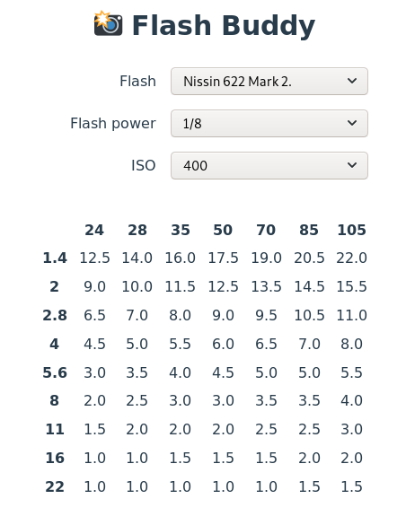

# 📸 Flash Buddy

Analog photographer's friend for calculating manual flash exposure based on the
guidenumbers from flash manufacturer.



Current implementation is a quick hack to meet my most immediate needs, but I'm
planning to add customization options, adding flash through UI and saving data /
selections to cloud.

## Contributing

Until there's better support for adding new flash data you are welcome to make
PR or open an issue with relevat flash guide number data.

## Development

Run app locally:

```
yarn start
```

Run unit tests:

```
yarn test
```

Watch for directory changes and run tests:

```
yarn test --watch
```

Build app:

```
yarn run build
```
